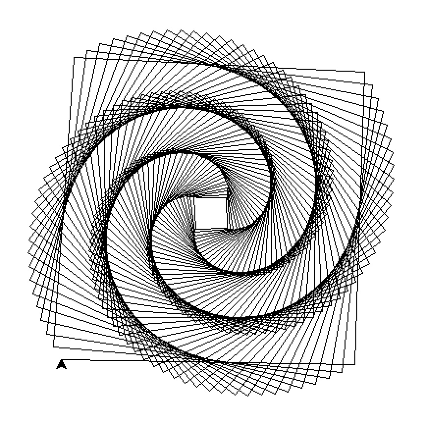

# Funny Python

在接触 Python 的岁月中，你一定遇到过不少有趣的代码段，让你惊叹它的神奇与美妙。

- 它可能是 Python 语言上的玄妙，比如在 Python 交互解释器下输入如下内容：

```python
>>> a = 257
>>> b = 257
>>> a is b # 按照直觉，"a is b" 应该是 True，但为什么是 False？
False
```

- 它可能是生活工作上的生趣盎然，比如用一行代码能打印出一个爱心。

- 它也可能是帮助你提升工作效率和达成个人目的的利器，比如实现一个小游戏、利用机器学习生成动漫头像、识别不良图片、实现聊天机器人等等。

你还有哪些有趣的 Python 代码段呢？不妨在本项目中通过 [Issue](https://github.com/PyChina/funny-python/issues/new) 的方式分享给我们，告诉我们它的玄妙处或是作用，让大家一起学习和享受乐趣。

同时也欢迎大家围观这些 [Issue](https://github.com/PyChina/funny-python)，给它们点赞~

---

- [AI](#AI)
  - [价值上亿的自动问答 AI 代码](#价值上亿的自动问答-AI-代码)
- [图像](#图像)
  - [螺旋正方形](#螺旋正方形)
- [Web](#Web)
  - [一行启动 Web 服务器](#一行启动-Web-服务器)

---

## AI

### 价值上亿的自动问答 AI 代码

> 代码

```python
# coding: utf-8
while True:
    text = raw_input()
    text = text.replace("吗", "")
    text = text.replace("你是谁", "我是价值上亿的AI")
    text = text.replace("你", "我")
    text = text.replace("？", "!")
    text = text.replace("?", "!")
    print(text)
```

> 说明

直接运行这段代码，输入问题，AI 都能为你解答：

```bash
>>> 你是谁？
我是价值上亿的AI!
>>> 你能听懂汉语吗？
我能听懂汉语!
>>> 你很聪明吗？
我很聪明!
```

## 图像

### 螺旋正方形

海龟作图画出正方形的螺旋堆叠。

> 前置条件

通常安装 Python 时自带该库。

> 代码

```python
from turtle import Turtle

t = Turtle()

def spiral(n):
    if n < 300:
        t.forward(n)
        t.right(89)
        spiral(n + 1)

spiral(30)
input('Press any key to continue...')
```

> 说明

效果如下：


## Web

### 一行启动 Web 服务器

> 代码

```bash
# Python 3
python3 -m http.server 8080

# Python 2
python2 -m SimpleHTTPServer 8080
```

> 说明

Python 内置的 HTTP 服务器，传文件特别方便。
